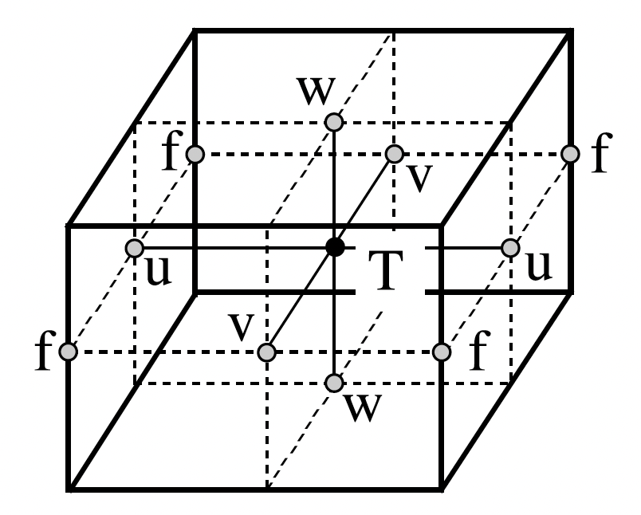

# **NEMODataTree**

Each recipe in the NEMO Cookbook leverages the `NEMODataTree` object to store NEMO ocean model outputs and to help perform diagnostic calculations.

In this User Guide, we provide an introduction to the `NEMODataTree`, including examples using outputs from the NEMO version 5 `AGRIF_DEMO` and `AMM12` reference configurations.

For further details on `NEMODataTree` constructors, properties and computation patterns, users are referred to the API documentation.

## What is a DataTree? :fontawesome-solid-folder-tree:

Ocean model simulations produce large collections of datasets, including physics, biogeochemistry, and sea ice diagnostics, which are defined on different grids. Moreover, ocean models configuration often include nested domains, where datasets of model diagnostics are produced for each of the parent, child and grandchild domains.

Organising these gridded datasets into a single, interpretable data structure has traditionally been a major challenge for researchers when developing their data analysis workflows.

This is where the `xarray.DataTree` comes in.

The `xarray.DataTree` extends the more familiar collection of xarray data structures (e.g., `xarray.Dataset`) to allow hierarchical grouping of datasets, similar to a local file system. Each `xarray.DataTree` is composed of a hierarchy of nodes, each containing a separate `xarray.Dataset`. 

```
DataTree('root')
├── global
    └── regional_nest
```

The root node sits at the top of the DataTree ('/') and each of its child nodes can have children (or sub-groups) of their own. In the example above, the root node has a single child node (`global`) storing the global domain outputs of an ocean model simulation. This in-turn has a single child node (`regional_nest`) storing the outputs of a regional nest inside the global domain.

We can hence describe each node in a DataTree in terms of the `parent` to which the node belongs, and its `children` - child nodes to which it is the parent. The root node is an important exception however, since it has no `parent` node.

To access a node in our DataTree, we use Python's standard dictionary syntax to define the path to the target node in the DataTree as follows:

```
dt['global/regional_nest']
```

We can then access the variables stored in the `xarray.Dataset` associated with a given node as follows:

```
ds['global/regional_nest']['var_name']
```

In summary, an `xarray.DataTree` can help ocean modellers organise complex outputs (nested domains, groups of variables) in a natural, hierarchical way by acting as a container for a collection of related  `xarray.Datasets`.


## What is a NEMODataTree? :ocean:  |  :fontawesome-solid-folder-tree:

`NEMODataTree` is an extension of the `xarray.DataTree` structure designed to store NEMO model output datasets as nodes in a hierarchical tree.

### NEMO Model Outputs

Many users will be familiar with the typical output format of NEMO model simulations, which includes separate netCDF files for groups of variables defined at the same type of grid points.



In NEMO, variables are arranged using a 3-dimensional Arakawa “C” grid (Mesinger and Arakawa, 1976), consisting of cells centred on scalar points **T** (e.g. temperature, salinity, density, and horizontal divergence).

Vector points (**u**, **v**, **w**) are defined at the centre of each cell face. The relative and planetary vorticity, ζ and f, are defined at **f** points, which are located at the centre of each vertical edge.

This arrangement of variables results in the following types of netCDF files:

- `...grid_T.nc` :material-arrow-right: scalar variables (e.g., conservative temperature & absolute salinity) defined at the centre of each model grid cell.

- `...grid_U.nc` :material-arrow-right: vector variables (e.g., zonal seawater velocity) defined at the centre of each eastern grid cell face.

- `...grid_V.nc` :material-arrow-right: vector variables (e.g., meridional seawater velocity) defined at the centre of each northern grid cell face.

- `...grid_W.nc` :material-arrow-right: vector variables (e.g., vertical seawater velocity) defined at the centre of each bottom grid cell face.

- `...grid_F.nc` :material-arrow-right: vector variables (e.g., relative vorticity) defined at the centre of each vertical edge.

Often global scalar diagnostics (e.g., global mean temperature) are also produced, resulting in a further type of netCDF file:

- `...scalar.nc` :material-arrow-right: 1-dimensional scalar variables calculated by aggregating a variable defined on the model **T** grid.

When the NEMO ocean engine is coupled to a sea ice model (e.g., [**SI3**](https://doi.org/10.5281/zenodo.7534900)), netCDF files will also be produced for sea ice variables using the following suffix:

- `...icemod.nc` :material-arrow-right: sea ice variables (e.g., sea ice concetration) defined at the centre of each model grid cell.

### Defining a Simple NEMODataTree

For a typical NEMO model configuration, consisting of a global parent domain coupled to a sea ice model, we can define a simple `DataTree`:
```
<xarray.DataTree 'nemo'>
Group: /
├── Group: /gridT
├── Group: /gridU
├── Group: /gridV
├── Group: /gridW
└── Group: /gridF
```

where the `gridT` child node contains time series of all of the variables output in `...grid_T.nc` files in a single `xarray.Dataset` and so on.

Importantly, we do not need a `domain` node containing the grid scale factors and masks defining each model domain since these variables are assigned to their respective grid nodes (e.g., horizontal grid scale factors `e1t` and `e2t` are stored in `gridT` etc.).

Below we summarise the steps required to define a `NEMODataTree` from a collection of output netCDF files:

**Steps to Define a NEMODataTree:**

1. For each type of netCDF output, open all available files as a single `xarray.Dataset` using `xarray.open_mfdataset()`.

2. Add domain variables stored in the **domain_cfg.nc** file to the each grid dataset (e.g., `e1t`, `e2t` are added to `gridT`).

3. Add / calculate masks for each grid type (e.g., `tmask` is added to `gridT`).

4. Redefine the `dims` and `coords` of each grid dataset to use `i`, `j`, `k` as used to define the semi-discrete equations in NEMO.

5. Assemble the `xarray.DataTree` using a dictionary of processed NEMO model grid datasets.

Clearly, we can see from the steps above that a `NEMODataTree` object is a specific case of the more general `xarray.DataTree` object.

### Defining a Nested NEMODataTree

For a nested NEMO model configuration, including a parent, child and grandchild domain, we can define a more complex `NEMODataTree`:
```
<xarray.DataTree 'nemo'>
Group: /
├── Group: /gridT
|   └── Group: /gridU/1_gridU
|       └── Group: /gridU/1_gridU/2_gridU
├── Group: /gridU
|   └── Group: /gridU/1_gridU
|       └── Group: /gridU/1_gridU/2_gridU
├── Group: /gridV
|   └── Group: /gridV/1_gridV
|       └── Group: /gridV/1_gridV/2_gridV
├── Group: /gridW
|   └── Group: /gridW/1_gridW
|       └── Group: /gridW/1_gridW/2_gridW
└── Group: /gridF
    └── Group: /gridF/1_gridF
        └── Group: /gridF/1_gridF/2_gridF
```

where each parent grid node (e.g., `gridT`) has a corresponding child grid node (e.g., `1_gridT`), which itself has a corresponding child (grandchild) node (e.g., `2_gridT`).

When defining a `NEMODataTree` for a nested configuration, there are two important additional steps required:

1. For each type of netCDF output, open all available files as a single `xarray.Dataset` using `xarray.open_mfdataset()`.

2. Add domain variables stored in the **domain_cfg.nc** file to the each grid dataset (e.g., `e1t`, `e2t` are added to `gridT`).

3. Add / calculate masks for each grid type (e.g., `tmask` is added to `gridT`).

4. Redefine the `dims` and `coords` of each grid dataset to use `i`, `j`, `k` as used to define the semi-discrete equations in NEMO.

5. **Clip nested child domains to remove ghost points along the boundaries & add a mapping from the parent grid indices to the child grid indices to the `coords`.**

6. **Assemble dictionaries of processed NEMO model grid datasets for each of the parent, child and grandchild domains.**

7. Assemble the `xarray.DataTree` using a nested dictionary of NEMO model domains.