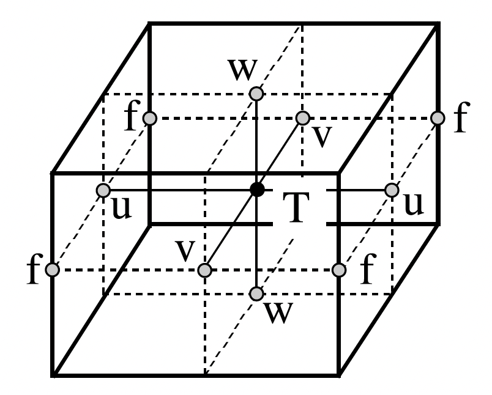

# User Guide

In this User Guide, we introduce the fundamentals of working with NEMO model outputs and provide detailed descriptions and examples of how to leverage NEMO Cookbook in your ocean analysis workflows.

## NEMO Fundamentals

The **Nucleus for European Modelling of the Ocean (NEMO)** is a state of the art modelling framework of ocean-related engines for research activities and forecasting services in ocean and climate science ([**Madec et al., 2024**](https://doi.org/10.5281/zenodo.14515373)).

The ***NEMO Ocean Engine*** solves the Primitive Equations using the traditional, centred second-order finite difference approximation. Prognostic variables are the three-dimensional velocity field, $(u, v, w)$, a non-linear sea surface height, $\eta$, the *Conservative Temperature*, $T$, and the *Absolute Salinity*, $S$.

### NEMO Model Grid

The ocean mesh (*i.e. location of all the scalar and vector points*) is defined in terms of a set of orthogonal curvilinear coordinates ($i, j, k$) with orthogonal unit vectors ($I, J, K$).

The geographical coordinate system ($\lambda, \phi, z$) can be expressed in terms of these curvilinear coordinates, such that longitude is $\lambda(i, j)$, latitude is $\phi(i, j)$, and depth is $z(k)$.

To write the scalar and vector operators in the
Primitive Equations in tensorial form, three scale factors are introduced describing the local deformation of the curvilinear coordinate system. Horizontal scale factors ($e_{1}$, $e_{2}$) are independent of $k$, while the vertical
scale factor $e_{3}$ is a single function of $k$.


<figure markdown="span">
  { width="300" }
</figure>

Variables are spatially discretised using a 3-dimensional Arakawa “C” grid ([**Mesinger and Arakawa, 1976**](https://core.ac.uk/download/pdf/141499575.pdf)), comprised of cells centered on scalar points **T** (e.g. conservative temperature, absolute salinity, and horizontal divergence).

Vector points (**U**, **V**, **W**) are defined at the center of each cell face. The relative and planetary vorticity, ζ and f, are defined at **T** points, which are located at the centre of each vertical edge.

All grid-points on the ocean mesh are located at integer or integer and a half values of ($i, j, k$) as shown below:

| Grid Type    | Grid Indices                 |
| -----------  | --------------------------   |
| `T`          | $(i, j, k)$                    |
| `U`          | $(i + \frac{1}{2}, j, k)$              |
| `V`          | $(i, j + \frac{1}{2}, k)$              |
| `W`          | $(i, j, k + \frac{1}{2})$              |
| `F`          | $(i + \frac{1}{2}, j + \frac{1}{2}, k)$        |
| `UW`         | $(i + \frac{1}{2}, j, k + \frac{1}{2})$        |
| `VW`         | $(i, j + \frac{1}{2}, k + \frac{1}{2})$        |
| `FW`         | $(i + \frac{1}{2}, j + \frac{1}{2}, k + \frac{1}{2})$  |

For each type of NEMO grid, we define the following properties:

1. **Grid Scale Factors...**

    - Horizontal scale factors (`e1{p}`, `e2{p}`)
    - Vertical scale factor (`e3{p}`)

    ..the volume of a cell is hence given by `(e1{p}.e2{p}.e3{p})`, where `p` is the type of grid point. Similarly, the horizontal area of the cell is given by `(e1{p}.e2{p})`.

2. **Geographical Coordinates...**

    - Longitude $\lambda(i,j)$ and Latitude $\phi(i,j)$ coordinates (`glam{hp}`, `gphi{hp}`)
    - Depth $z(k)$ coordinate (`depth{p}`)

    ...where `p` (`hp`) is the type of (horizontal) grid point. For example, the geographical coordinates corresponding to a **W**-point are (`glamt`, `gphit`, `depthw`).

3. **Land-Sea Masks...**

    - 2-dimensional horizontal (unique point) mask $pmaskutil(i, j)$ given by `{p}maskutil`
    - 3-dimensional land-sea mask $pmask(i, j, k)$ given by `{p}mask`

    ...where $p$ | `p` is the type of grid point. Here, sea points are identified as `True` and land points as `False`.

For more information on the spatial discretisation of variables in NEMO, see [**Chapter 3 of the NEMO Reference Manual**](https://doi.org/10.5281/zenodo.14515373).

## NEMO Data Structures

Each recipe in the NEMO Cookbook leverages the `NEMODataTree` and `NEMODataArray` structures to store NEMO model outputs and to perform grid-aware computations.

Here, we provide an introduction to the `NEMODataTree` and `NEMODataArray`, including examples using outputs from the NEMO version 5 `AGRIF_DEMO` and `AMM12` reference configurations.

For further details on `NEMODataTree` constructors, properties and `NEMODataArray` computation patterns, users are referred to the [API Reference] documentation.

[API Reference]: reference.md

### NEMODataTree :ocean: :fontawesome-solid-folder-tree:
---

`NEMODataTree` is an extension of the `xarray.DataTree` structure designed to store NEMO model output datasets as nodes in a hierarchical tree.

#### **What is a DataTree?** :fontawesome-solid-folder-tree:

Ocean model simulations produce large collections of datasets, including physics, biogeochemistry, and sea ice diagnostics, which are defined on different grids. Moreover, ocean models configuration often include nested domains, where datasets of model diagnostics are produced for each of the parent, child and grandchild domains.

Organising these gridded datasets into a single, interpretable data structure has traditionally been a major challenge for researchers when developing their data analysis workflows.

This is where the `xarray.DataTree` comes in.

The `xarray.DataTree` extends the more familiar collection of xarray data structures (e.g., `xarray.Dataset`) to allow hierarchical grouping of datasets, similar to a local file system. Each `xarray.DataTree` is composed of a hierarchy of nodes, each containing a separate `xarray.Dataset`. 

```
<xarray.DataTree 'OceanModel'>
Group: /
└── Group: /global
    ├── Group: /global/regional_nest_1
    └── Group: /global/regional_nest_2
```

The root node sits at the top of the DataTree ('/') and each of its child nodes can have children (or sub-groups) of their own. In the example above, the root node has a single child node (`global`) storing the global domain outputs of an ocean model simulation `OceanModel`. This in-turn has two child nodes (`regional_nest_1` & `regional_nest_2`) storing the outputs of two regional nests located inside the global domain.

We can hence describe each node in a DataTree in terms of the `parent` to which the node belongs, and its `children` - child nodes to which it is the parent. The root node is an important exception however, since it has no `parent` node.

To access a node in our DataTree, we use Python's standard dictionary syntax to define the path to the target node in the DataTree as follows:

```
dt['global/regional_nest']
```

We can then access the variables stored in the `xarray.Dataset` associated with a given node as follows:

```
ds['global/regional_nest']['var_name']
```

In summary, an `xarray.DataTree` can help ocean modellers organise complex outputs (nested domains, groups of variables) in a natural, hierarchical way by acting as a container for a collection of related  `xarray.Datasets`.


#### **What is a NEMODataTree?**

`NEMODataTree` is an extension of the `xarray.DataTree` structure designed to store NEMO model output datasets as nodes in a hierarchical tree.

#### **NEMO Outputs**

Although many experienced researchers will be familiar with the typical output format of NEMO model simulations, we provide a brief summary below for new users.

NEMO model simulations write time-averaged diagnostics to output files in netCDF4 format using an external I/O
library and server named [XIOS](https://forge.ipsl.jussieu.fr/ioserver/wiki/documentation/).

Typically, separate netCDF files are produced at each time-averaging interval (e.g., monthly) for groups of variables located at the same type of grid points. This results in the following types of netCDF files:

- `...grid_T.nc` :material-arrow-right: scalar variables (e.g., conservative temperature & absolute salinity) defined at the centre of each model grid cell.

- `...grid_U.nc` :material-arrow-right: vector variables (e.g., zonal seawater velocity) defined at the centre of each eastern grid cell face.

- `...grid_V.nc` :material-arrow-right: vector variables (e.g., meridional seawater velocity) defined at the centre of each northern grid cell face.

- `...grid_W.nc` :material-arrow-right: vector variables (e.g., vertical seawater velocity) defined at the centre of each bottom grid cell face.

- `...grid_F.nc` :material-arrow-right: vector variables (e.g., relative vorticity) defined at the centre of each vertical edge.

Often global scalar diagnostics (e.g., global mean temperature) are also produced, resulting in a further type of netCDF file:

- `...scalar.nc` :material-arrow-right: 1-dimensional scalar variables calculated by aggregating a variable defined on the model **T** grid.

When the NEMO ocean engine is coupled to a sea ice model (e.g., [**SI3**](https://doi.org/10.5281/zenodo.7534900)), netCDF files will also be produced for sea ice variables using the following suffix:

- `...icemod.nc` :material-arrow-right: sea ice variables (e.g., sea ice concetration) defined at the centre of each model grid cell.

#### **Creating a Simple NEMODataTree**

For a typical NEMO model configuration, consisting of a global parent domain coupled to a sea ice model, we can define a simple `DataTree`:
```
<xarray.DataTree 'nemo'>
Group: /
├── Group: /gridT
├── Group: /gridU
├── Group: /gridV
├── Group: /gridW
└── Group: /gridF
```

where the `gridT` child node contains time series of scalar variables stored in the `...grid_T.nc` files in a single `xarray.Dataset` and so on.

**Domain Variables**

Importantly, a `NEMODataTree` does not need a `domain` node to store the grid scale factors and masks associated with each model domain. 

*Why?*

This is because domain variables are assigned to their respective grid nodes during pre-processing (e.g., horizontal grid scale factors `e1t` and `e2t` are stored in `gridT` etc.).

!!! tip "Note on Quasi-Eulerian Vertical Coordinates..."

    **The vertical grid scale factors (e.g., `e3t`, `e3u` etc.) assigned to a `NEMODataTree` are dependent upon the type of vertical coordinate used in the given NEMO model simulation.**

    Typically, NEMO model simulations use a quasi-eulerian vertical coordinate which absorbs the divergence of horizontal barotropic velocities (e.g., $z^{*}$ or $s^{*}$), meaning that vertical grid scale factors evolve through time (i.e., a time-varying free surface translates into variations in grid cell thickness).

    `NEMODataTree` considers the case of time-evolving vertical grid scale factors to be the default as the `key_linssh` argument to the `.from_paths()` and `.from_datasets()` constructors is set to be `False` by default. This means that vertical grid scale factors must be provided in the netCDF files or `xarray.Datasets` used to define each NEMO model grid node in the `NEMODataTree`.

    For NEMO model simulations using a linear free surface approximation (i.e., variations in the free surface are neglected compared to the depth of the ocean), we should use `key_linssh=True` to indicate that vertical grid scale factors remain fixed through time and should be read directly from the reference variables contained within the domain_cfg netCDF file or `xarray.Dataset` (e.g., `e3t_0`, `e3u_0` etc.).

**Dimensions & Coordinates**

Typically, the netCDF files output by NEMO model simulations have dimensions (`depth{k}`, `y`, `x`), where *k* is the grid point type.

During the construction of a NEMODataTree, these coordinate dimensions are transformed into the NEMO model grid indices (**i**, **j**, **k**) according to the Table included in the **NEMO Model Grid** section above. This has two important implications:

1. The `xarray.Datasets` stored in each grid node share the same coordinate dimension names (`i`, `j`, `k`), but are staggered according to where variables are position on the NEMO model grid.

2. All grid indices use Fortran (1-based) indexing consistent with their definition in the original NEMO model code.

In practice, this means that a variable defined at the first T-point will be at (`i=1`, `j=1`), whereas a variable located at the first U-point will be at (`i=1.5`, `j=1`). This approach was chosen to ensure users encounter alignment errors when attempting to calculate diagnostics using variables defined on different grids. Instead, scalar or vector variables should be interpolated onto the desired grid before computation.

A further practical implication is that users should always use `.sel()` to subset data variables according to their grid indices on the NEMO ocean mesh.

**Summary**

Below we summarise the steps required to define a `NEMODataTree` from a collection of output netCDF files:

!!! example "Steps to Define a NEMODataTree"

    1. For each type of netCDF output, open all available files as a single `xarray.Dataset` using `xarray.open_mfdataset()`.

    2. Add domain variables stored in the **domain_cfg.nc** file to the each grid dataset (e.g., `e1t`, `e2t` are added to `gridT`).

    3. Add / calculate masks for each grid type (e.g., `tmask` is added to `gridT`).

    4. Redefine the `dims` and `coords` of each grid dataset to use `i`, `j`, `k` as used to define the semi-discrete equations in NEMO.

    5. Assemble the `xarray.DataTree` using a dictionary of processed NEMO model grid datasets.

The steps above highlight that the `NEMODataTree` is simply a specific case of the more general `xarray.DataTree` structure.

#### **Creating a Nested NEMODataTree**

For a nested NEMO model configuration, including a parent, child and grandchild domain, we can define a more complex `NEMODataTree`:
```
<xarray.DataTree 'nemo'>
Group: /
├── Group: /gridT
|   └── Group: /gridT/1_gridT
|       └── Group: /gridT/1_gridT/2_gridT
├── Group: /gridU
|   └── Group: /gridU/1_gridU
|       └── Group: /gridU/1_gridU/2_gridU
├── Group: /gridV
|   └── Group: /gridV/1_gridV
|       └── Group: /gridV/1_gridV/2_gridV
├── Group: /gridW
|   └── Group: /gridW/1_gridW
|       └── Group: /gridW/1_gridW/2_gridW
└── Group: /gridF
    └── Group: /gridF/1_gridF
        └── Group: /gridF/1_gridF/2_gridF
```

where each parent grid node (e.g., `gridT`) has a corresponding child grid node (e.g., `1_gridT`), which itself has a corresponding child (grandchild) node (e.g., `2_gridT`).

**Domain Variables**

Nested child / grandchild domain variables are also assigned to their respective grid nodes during pre-processing (e.g., horizontal grid scale factors `e1t` and `e2t` are stored in `gridT` etc.).

**Dimensions & Coordinates**

To ensure that the dimensions of nested child / grandchild domains are distinct from their parent, a prefix is added to all grid indices and associated geographical coordinate variables.

The prefix corresponds to the unique domain number used to identify each child and grandchild domain during the construction the `NEMODataTree`. Hence, in the example above, the child grid node `1_gridT` will have NEMO model grid indices (`i1`, `j1`, `k1`) and associated coordinates `1_glamt(j1, i1)`, `1_gphit(j1, i1)` etc.

**Summary**

In summary, defining a `NEMODataTree` for a nested configuration includes two important additional steps:

!!! example "Steps to Define a NEMODataTree"
    1. For each type of netCDF output, open all available files as a single `xarray.Dataset` using `xarray.open_mfdataset()`.

    2. Add domain variables stored in the **domain_cfg.nc** file to the each grid dataset (e.g., `e1t`, `e2t` are added to `gridT`).

    3. Add / calculate masks for each grid type (e.g., `tmask` is added to `gridT`).

    4. Redefine the `dims` and `coords` of each grid dataset to use `i{dom}`, `j{dom}`, `k{dom}` as used to define the semi-discrete equations in NEMO, where *dom* is the unique domain number.

    5. **Clip nested child domains to remove ghost points along the boundaries & add a mapping from the parent grid indices to the child grid indices to the `coords`.**

    6. **Assemble dictionaries of processed NEMO model grid datasets for each of the parent, child and grandchild domains.**

    7. Assemble the `xarray.DataTree` using a nested dictionary of NEMO model domains.

### NEMODataArray :ocean: :simple-databricks:
---

`NEMODataArray` is an extension of the familiar `xarray.DataArray` structure which supports grid-aware computation using variables defined on a NEMO model grid.

Each `NEMODataArray` interfaces with a parent `NEMODataTree` to provide useful properties, grid-aware operators (e.g., derivatives and integrals) and statistics (e.g., masked statistics and weighted means), alongside utility methods to interpolate variables onto neighbouring NEMO model grids.

#### **Creating a NEMODataArray**

There are two ways to create a `NEMODataArray` from a variable defined on a given NEMO model grid:

1. **Manual NEMODataArray Creation...**

    We can create a `NEMODataArray` from an existing `xarray.DataArray` variable and `NEMODataTree` using the following syntax:

```python
NEMODataArray(da=thetao_con, tree=nemo, grid="gridT")
```

```
<NEMODataTree 'My NEMO model'>
<NEMODataArray 'thetao_con' (Domain: '.', Grid: 'gridT', Grid Type: 'T')>

<xarray.DataArray 'thetao_con' (time_counter: 48, k: 75, j: 331, i: 360)> Size: 2GB
...
```

Here, we have created a `NEMODataArray` using an `xarray.DataArray` containing the conservative temperature variable (`thetao_con`) and the path to the **T**-grid node (`"gridT"`) of the `NEMODataTree` to which it belongs (`nemo`).

2. **Using a NEMODataTree for NEMODataArray Creation...**

    A more natural approach to `NEMODataArray` creation is to use the path to the variable in the `NEMODataTree` directly:

```python
nemo["gridT/thetao_con"]
```

```
<NEMODataTree 'My NEMO model'>
<NEMODataArray 'thetao_con' (Domain: '.', Grid: 'gridT', Grid Type: 'T')>

<xarray.DataArray 'thetao_con' (time_counter: 48, k: 75, j: 331, i: 360)> Size: 2GB
...
```

Note, we can also access the conservative temperature `xarray.DataArray` by first passing the path to the NEMO grid on which the variable is defined:

```python
nemo["gridT"]["thetao_con"]
```

#### **NEMODataArray Properties**

Each `NEMODataArray` has several key properties to support grid-aware computation...

- `.data` :material-arrow-right: Underlying `xarray.DataArray` of the NEMO output variable.

- `.grid` :material-arrow-right: Path to NEMO model grid node where variable is stored.

- `.grid_type` :material-arrow-right: Type of NEMO model grid where variable is defined.

- `.metrics` :material-arrow-right: Dictionary of NEMO model grid scale factors (e.g., `e1t`, `e2t` etc.) associated with the variable.

- `.mask` :material-arrow-right: Variable land-sea mask (`xarray.DataArray`).

- `.masked` :material-arrow-right: Returns variable `NEMODataArray` with land-sea mask applied. 

#### **NEMODataArray Core Operations**

In addition to being simply a container for a NEMO output variable, `NEMODataArray` facilitates grid-aware computation via the following operations: 

- **Masking** :material-arrow-right: `.apply_mask()`.

- **Selections** :material-arrow-right: `.sel_like()`.

- **Grid Operators** :material-arrow-right: `.diff()`, `.derivative()`, `.integral()`, `.depth_integral()`.

- **Statistics:** :material-arrow-right: `.weighted_mean()`, `.masked_statistic()`.

- **Interpolation:** :material-arrow-right: `.interp_to()`.

- **Grid Transformations:** :material-arrow-right: `.transform_vertical_grid()`.

#### **Interoperability with xarray**

`NEMODataArray` supports all standard `xarray.DataArray` operations by design. Why reinvent the wheel, right?

To achieve this, `NEMODataArray` will perform the operations on the underlying `xarray.DataArray` before attempting to return the result as an `NEMODataArray` whenever possible. Otherwise, the default return type of the operation is returned.

```python
nemo["gridT/tos_con"].chunk({"i": 50})
```
Here, the chunking operation is performed using the `.data` property (`xarray.DataArray`) of the sea surface temperature variable, before being returned as a `NEMODataArray`:
```
<NEMODataTree 'My NEMO model'>
  <NEMODataArray 'tos_con' (Domain: '.', Grid: 'gridT', Grid Type: 'T')>

<xarray.DataArray 'tos_con' (time_counter: 48, j: 331, i: 360)> Size: 23MB
dask.array<rechunk-merge, shape=(48, 331, 360), dtype=float32, chunksize=(1, 331, 50), chunktype=numpy.ndarray>
Coordinates:
  * time_counter   (time_counter) datetime64[ns] 384B 1976-07-02 ... 2023-07-...
    time_centered  (time_counter) datetime64[ns] 384B dask.array<chunksize=(1,), meta=np.ndarray>
    gphit          (j, i) float64 953kB dask.array<chunksize=(331, 50), meta=np.ndarray>
    glamt          (j, i) float64 953kB dask.array<chunksize=(331, 50), meta=np.ndarray>
  * j              (j) int64 3kB 1 2 3 4 5 6 7 8 ... 325 326 327 328 329 330 331
  * i              (i) int64 3kB 1 2 3 4 5 6 7 8 ... 354 355 356 357 358 359 360
```

#### **Method Chaining**

One of the most valuable features of a `NEMODataArray` is its native support for method-chaining, enabling us to build complex diagnostics, such as...

```python
nemo["gridT/thetao_con"].apply_mask(mask=my_mask).weighted_mean(dims=["i", "j"], skipna=True).plot()
```

... where we apply `my_mask` to the global sea surface temperature field, calculate the horizontal grid cell area-weighted mean, and plot the resulting time-series in a single line of code.

Support for method-chaining also includes indexing operations, such as `.sel()`, `.isel()` and .`sel_like()`, and reduction operations, such as `.mean()`, `.min()` and `.max()`, which will modify the shape of the `NEMODataArray`.

## Example NEMODataTrees

In this section, we demonstrate how to construct `NEMODataTrees` using global, regional, nested and coupled NEMO ocean sea-ice outputs.

> Users can also explore the following examples using the `example_nemodatatrees.ipynb` Jupyter Notebook available in the `recipes` directory.

To get started, let's begin by importing the Python packages we'll be using:

```python
import xarray as xr
import nemo_cookbook as nc
from nemo_cookbook import NEMODataTree
```

### **Global Ocean Sea-Ice Models:**
---

**1. `AGRIF_DEMO`**

Let's start by creating a `NEMODataTree` using example outputs from the global `AGRIF_DEMO` NEMO reference configuration.

`AGRIF_DEMO` is based on the `ORCA2_ICE_PISCES` reference configuration with the inclusion of 3 online nested domains.

Here, we will only consider the 2° global parent domain.

Further information on this reference configuration can be found [**here**](https://sites.nemo-ocean.io/user-guide/cfgs.html#agrif-demo).

---

**NEMO Cookbook** includes a selection of example NEMO model output datasets accessible via cloud object storage.

`nemo_cookbook.examples.get_filepaths()` is a convenience function used to download and generate local filepaths for an available NEMO reference configuration.

```python
filepaths = nc.examples.get_filepaths("AGRIF_DEMO")

filepaths
```

The `get_filepaths()` function will download each of the files to your local machine, returning a dictionary of filepaths for the chosen configuration (`AGRIF_DEMO`):

```
{'domain_cfg.nc': '/Users/me/Library/Caches/nemo_cookbook/AGRIF_DEMO/domain_cfg.nc',
 '2_domain_cfg.nc': '/Users/me/Library/Caches/nemo_cookbook/AGRIF_DEMO/2_domain_cfg.nc',
 '3_domain_cfg.nc': '/Users/me/Library/Caches/nemo_cookbook/AGRIF_DEMO/3_domain_cfg.nc',
 'ORCA2_5d_00010101_00010110_grid_T.nc': '/Users/me/Library/Caches/nemo_cookbook/AGRIF_DEMO/ORCA2_5d_00010101_00010110_grid_T.nc',
 ...
 '3_Nordic_5d_00010101_00010110_icemod.nc': '/Users/me/Library/Caches/nemo_cookbook/AGRIF_DEMO/3_Nordic_5d_00010101_00010110_icemod.nc'
 }
```

Next, we need to define the `paths` dictionary, which contains the filepaths corresponding to our global parent domain.

We populate the `parent` dictionary with the filepaths to the `domain_cfg` and `gridT/U/V/W` netCDF files produced for the `AGRIF_DEMO` parent domain. 

```python
paths = {"parent": {
         "domain": filepaths["domain_cfg.nc"],
         "gridT": filepaths["ORCA2_5d_00010101_00010110_grid_T.nc"],
         "gridU": filepaths["ORCA2_5d_00010101_00010110_grid_U.nc"],
         "gridV": filepaths["ORCA2_5d_00010101_00010110_grid_V.nc"],
         "gridW": filepaths["ORCA2_5d_00010101_00010110_grid_W.nc"],
         "icemod": filepaths["ORCA2_5d_00010101_00010110_icemod.nc"]
        },
        }
```

We can construct a new `NEMODataTree` called `nemo` using the `.from_paths()` constructor.

Notice, that we also need to specify that our global parent domain is zonally periodic (`iperio=True`) and north folding on T-points (`nftype = "T"`) rather than a closed (regional) domain.

```python
nemo = NEMODataTree.from_paths(paths, iperio=True, nftype="T")

nemo
```

This returns the following `xarray.DataTree`, where we have truncated the outputs for improved readability:

```
<xarray.DataTree>
Group: /
│   Dimensions:               (time_counter: 2, axis_nbounds: 2, ncatice: 5)
│   ...
│ 
├── Group: /gridT
│       Dimensions:               (time_counter: 2, axis_nbounds: 2, j: 148, i: 180,
│                                  ncatice: 5, k: 31)
│       Coordinates:
│           time_centered         (time_counter) object 16B 0001-01-03 12:00:00 0001-...
│         * deptht                (k) float32 124B 5.0 15.0 25.0 ... 4.75e+03 5.25e+03
│           time_instant          (time_counter) object 16B ...
│           gphit                 (j, i) float64 213kB ...
│           glamt                 (j, i) float64 213kB ...
│         * k                     (k) int64 248B 1 2 3 4 5 6 7 ... 25 26 27 28 29 30 31
│         * j                     (j) int64 1kB 1 2 3 4 5 6 ... 143 144 145 146 147 148
│         * i                     (i) int64 1kB 1 2 3 4 5 6 ... 175 176 177 178 179 180
│       Dimensions without coordinates: axis_nbounds
│       Data variables: (12/87)
│           time_centered_bounds  (time_counter, axis_nbounds) object 32B 0001-01-01 ...
│           time_counter_bounds   (time_counter, axis_nbounds) object 32B 0001-01-01 ...
│           simsk                 (time_counter, j, i) float32 213kB ...
│           simsk05               (time_counter, j, i) float32 213kB ...
│           simsk15               (time_counter, j, i) float32 213kB ...
│           snvolu                (time_counter, j, i) float32 213kB ...
│           ...                    ...
│           e1t                   (j, i) float64 213kB ...
│           e2t                   (j, i) float64 213kB ...
│           top_level             (j, i) int32 107kB ...
│           bottom_level          (j, i) int32 107kB ...
│           tmask                 (k, j, i) bool 826kB False False False ... False False
│           tmaskutil             (j, i) bool 27kB False False False ... False False
│       Attributes:
│           name:         ORCA2_5d_00010101_00010110_icemod
│           description:  ice variables
│           title:        ice variables
│           Conventions:  CF-1.6
│           timeStamp:    2025-Sep-13 17:44:13 GMT
│           uuid:         c6c24bd5-1d2b-4d7b-98b5-8d379c94e84b
│           nftype:       T
│           iperio:       True
├── Group: /gridU
│       Dimensions:               (k: 31, axis_nbounds: 2, time_counter: 2, j: 148,
│                                  i: 180)
│       ...
├── Group: /gridV
│       Dimensions:               (k: 31, axis_nbounds: 2, time_counter: 2, j: 148,
│                                  i: 180)
│       ...
├── Group: /gridW
│       Dimensions:               (k: 31, axis_nbounds: 2, time_counter: 2, j: 148,
│                                  i: 180)
│       ...
└── Group: /gridF
        Dimensions:       (j: 148, i: 180, k: 31)
        ...
```

--- 

**2. `NOC Near-Present Day eORCA1`**

Next, we'll consider monthly-mean outputs from the National Oceanography Centre Near-Present-Day global eORCA1 configuration of NEMO forced using ERA5 atmospheric reanalysis from 1976-present. 

For more details on this model configuration and the available outputs, users can explore the Near-Present-Day documentation [**here**](https://noc-msm.github.io/NOC_Near_Present_Day/).

---

The eORCA1 ERA5v1 NPD data are stored in publicly available Icechunk repositories accessible via the NOC [**OceanDataStore**](https://noc-msm.github.io/OceanDataStore/catalog_guide/) library. In this example, we will show how to use to the **OceanDataCatalog** API to remotely access NOC NPD outputs and use the `.from_datasets()` constructor to create a NEMODataTree.

Users can find more information on how to get started using the **OceanDataCatalog** to search for and access available NEMO model outputs [**here**](https://noc-msm.github.io/OceanDataStore/).

```python 
from OceanDataStore import OceanDataCatalog

# Create a new OceanDataCatalog to access the NOC STAC:
catalog = OceanDataCatalog(catalog_name="noc-model-stac")

# Opening domain_cfg:
ds_domain = catalog.open_dataset(id="noc-npd-era5/npd-eorca1-era5v1/gn/domain/domain_cfg")

# Opening gridT dataset, including sea surface temperature (°C) and sea surface height (m):
ds_gridT = catalog.open_dataset(id="noc-npd-era5/npd-eorca1-era5v1/gn/T1m",
                                variable_names=['tos_con', 'zos'],
                                start_datetime='2000-01',
                                end_datetime='2020-12',
                                )
```

Next, let's create a `NEMODataTree` from a dictionary of eORCA1 ERA5v1 `xarray.Datasets`, specifying that our global domain is zonally periodic (`iperio=True`) and north folding on T-points (`nftype = "F"`).

```python
datasets = {"parent": {"domain": ds_domain.squeeze(), "gridT": ds_gridT}}

nemo = NEMODataTree.from_datasets(datasets=datasets, iperio=True, nftype="F")

nemo
```

```
<xarray.DataTree>
Group: /
│   Dimensions:        (time_counter: 240)
│   ...
│ 
├── Group: /gridT
│   Dimensions:        (time_counter: 240)
│       Dimensions:        (time_counter: 240, j: 331, i: 360, k: 75)
│       Coordinates:
│           time_centered  (time_counter) datetime64[ns] 5kB dask.array<chunksize=(1,), meta=np.ndarray>
│           gphit          (j, i) float64 953kB dask.array<chunksize=(331, 360), meta=np.ndarray>
│           glamt          (j, i) float64 953kB dask.array<chunksize=(331, 360), meta=np.ndarray>
│         * k              (k) int64 600B 1 2 3 4 5 6 7 8 9 ... 68 69 70 71 72 73 74 75
│         * j              (j) int64 3kB 1 2 3 4 5 6 7 8 ... 325 326 327 328 329 330 331
│         * i              (i) int64 3kB 1 2 3 4 5 6 7 8 ... 354 355 356 357 358 359 360
│       Data variables:
│           tos_con        (time_counter, j, i) float32 275MB dask.array<chunksize=(1, 331, 360), meta=np.ndarray>
│           zos            (time_counter, j, i) float32 275MB dask.array<chunksize=(1, 331, 360), meta=np.ndarray>
│           e1t            (j, i) float64 953kB dask.array<chunksize=(331, 360), meta=np.ndarray>
│           e2t            (j, i) float64 953kB dask.array<chunksize=(331, 360), meta=np.ndarray>
│           top_level      (j, i) int32 477kB dask.array<chunksize=(331, 360), meta=np.ndarray>
│           bottom_level   (j, i) int32 477kB dask.array<chunksize=(331, 360), meta=np.ndarray>
│           tmask          (k, j, i) bool 9MB False False False ... False False False
│           tmaskutil      (j, i) bool 119kB False False False ... False False False
│       Attributes:
│           nftype:   F
│           iperio:   True
├── Group: /gridU
│       Dimensions:       (j: 331, i: 360, k: 75)
│       ...
├── Group: /gridV
│       Dimensions:       (j: 331, i: 360, k: 75)
│       ...
├── Group: /gridW
│       Dimensions:       (j: 331, i: 360, k: 75)
│       ...
└── Group: /gridF
        Dimensions:       (j: 331, i: 360, k: 75)
        ...
```

### **Regional Ocean Models:**

---

**`AMM12`**

We can also construct a `NEMODataTree` using outputs from regional NEMO ocean model simulations.

Here, we will consider example outputs from the regional `AMM12` NEMO reference configuration.

The AMM, Atlantic Margins Model, is a regional model covering the Northwest European Shelf domain on a regular lat-lon grid at approximately 12km horizontal resolution. `AMM12` uses the vertical s-coordinates system, GLS turbulence scheme, and tidal lateral boundary conditions using a flather scheme.

Further information on this reference configuration can be found [**here**](https://sites.nemo-ocean.io/user-guide/cfgs.html#amm12).

---

```python
filepaths = nc.examples.get_filepaths("AMM12")

filepaths
```

```
{'domain_cfg.nc': '/Users/me/Library/Caches/nemo_cookbook/AMM12/domain_cfg.nc',
 'AMM12_1d_20120102_20120110_grid_T.nc': '/Users/me/Library/Caches/nemo_cookbook/AMM12/AMM12_1d_20120102_20120110_grid_T.nc',
 'AMM12_1d_20120102_20120110_grid_U.nc': '/Users/me/Library/Caches/nemo_cookbook/AMM12/AMM12_1d_20120102_20120110_grid_U.nc',
 'AMM12_1d_20120102_20120110_grid_V.nc': '/Users/me/Library/Caches/nemo_cookbook/AMM12/AMM12_1d_20120102_20120110_grid_V.nc'
 }
```
As we showed in the `AGRIF_DEMO` example, we need to populate the `paths` dictionary with the `domain_cfg` and `gridT/U/V` filepaths corresponding to our regional model domain.

```python
paths = {"parent": {
         "domain": filepaths["domain_cfg.nc"],
         "gridT": filepaths["AMM12_1d_20120102_20120110_grid_T.nc"],
         "gridU": filepaths["AMM12_1d_20120102_20120110_grid_U.nc"],
         "gridV": filepaths["AMM12_1d_20120102_20120110_grid_V.nc"],
        },
        }
```

Next, we can construct a new `NEMODataTree` called `nemo` using the `.from_paths()` constructor.

Note, we do not actually need to specify that our regional domain is not zonally periodic in this case, given that, by default, `iperio=False`.

```python
nemo = NEMODataTree.from_paths(paths, iperio=False)

nemo
```

```
<xarray.DataTree>
Group: /
│   Dimensions:               (time_counter: 8, axis_nbounds: 2)
│   ...
│ 
├── Group: /gridT
│       Dimensions:               (time_counter: 8, axis_nbounds: 2, j: 224, i: 198,
│                                  k: 51)
│       Coordinates:
│           time_centered         (time_counter) datetime64[ns] 64B ...
│           gphit                 (j, i) float64 355kB ...
│           glamt                 (j, i) float64 355kB ...
│         * k                     (k) int64 408B 1 2 3 4 5 6 7 ... 45 46 47 48 49 50 51
│         * j                     (j) int64 2kB 1 2 3 4 5 6 ... 219 220 221 222 223 224
│         * i                     (i) int64 2kB 1 2 3 4 5 6 ... 193 194 195 196 197 198
│       Dimensions without coordinates: axis_nbounds
│       Data variables:
│           time_centered_bounds  (time_counter, axis_nbounds) datetime64[ns] 128B ...
│           time_counter_bounds   (time_counter, axis_nbounds) datetime64[ns] 128B ...
│           tos                   (time_counter, j, i) float32 1MB ...
│           sos                   (time_counter, j, i) float32 1MB ...
│           zos                   (time_counter, j, i) float32 1MB ...
│           e1t                   (j, i) float64 355kB ...
│           e2t                   (j, i) float64 355kB ...
│           top_level             (j, i) int32 177kB ...
│           bottom_level          (j, i) int32 177kB ...
│           tmask                 (k, j, i) bool 2MB False False False ... False False
│           tmaskutil             (j, i) bool 44kB False False False ... False False
│       Attributes:
│           nftype:   None
│           iperio:   False
├── Group: /gridU
│       Dimensions:               (time_counter: 8, axis_nbounds: 2, j: 224, i: 198,
│                                  k: 51)
│       ...
├── Group: /gridV
│       Dimensions:               (time_counter: 8, axis_nbounds: 2, j: 224, i: 198,
│                                  k: 51)
│       ...
├── Group: /gridW
│       Dimensions:       (j: 224, i: 198, k: 51)
│       ...
└── Group: /gridF
        Dimensions:       (j: 224, i: 198, k: 51)
        ...
```

### **Nested Global Ocean Sea-Ice Models:**

---

`AGRIF_DEMO`

Returning to our `AGRIF_DEMO` NEMO reference configuration, we can also construct a more complex `NEMODataTree` to store the outputs of the global parent and its child domains in a single data structure.

We will make use of the two successively nested domains located in the Nordic Seas, with the finest grid (1/6°) spanning the Denmark strait. This grandchild domain also benefits from “vertical nesting”, meaning that it has 75 geopotential z-coordinate levels, compared with 31 levels in its parent domain.

---

```python 
filepaths = nc.examples.get_filepaths("AGRIF_DEMO")
```

Let's start by defining the `paths` dictionary for the ORCA2 global parent domain and its child and grandchild domains. Notice, that for `child` and `grandchild` domains, we must also specify a unique domain number, given that we could include further child or grandchild nests.

```python
paths = {"parent": {
        "domain": filepaths["domain_cfg.nc"],
        "gridT": filepaths["ORCA2_5d_00010101_00010110_grid_T.nc"],
        "gridU": filepaths["ORCA2_5d_00010101_00010110_grid_U.nc"],
        "gridV": filepaths["ORCA2_5d_00010101_00010110_grid_V.nc"],
        "gridW": filepaths["ORCA2_5d_00010101_00010110_grid_W.nc"],
        "icemod": filepaths["ORCA2_5d_00010101_00010110_icemod.nc"]
        },
        "child": {
        "1":{
        "domain": filepaths["2_domain_cfg.nc"],
        "gridT": filepaths["2_Nordic_5d_00010101_00010110_grid_T.nc"],
        "gridU": filepaths["2_Nordic_5d_00010101_00010110_grid_U.nc"],
        "gridV": filepaths["2_Nordic_5d_00010101_00010110_grid_V.nc"],
        "gridW": filepaths["2_Nordic_5d_00010101_00010110_grid_W.nc"],
        "icemod": filepaths["2_Nordic_5d_00010101_00010110_icemod.nc"]
        }},
        "grandchild": {
        "2":{
        "domain": filepaths["3_domain_cfg.nc"],
        "gridT": filepaths["3_Nordic_5d_00010101_00010110_grid_T.nc"],
        "gridU": filepaths["3_Nordic_5d_00010101_00010110_grid_U.nc"],
        "gridV": filepaths["3_Nordic_5d_00010101_00010110_grid_V.nc"],
        "gridW": filepaths["3_Nordic_5d_00010101_00010110_grid_W.nc"],
        "icemod": filepaths["3_Nordic_5d_00010101_00010110_icemod.nc"]
        }},
        }
```

Next, we need to construct a `nests` dictionary which contains the properties which define each nested domain. These include:

- Unique domain number (mapping properties to entries in our `paths` directory).
- Parent domain (to which unique domain does this belong).
- Zonal periodicity of child / grandchild domain (`iperio`).
- Horizontal grid refinement factors (`rx`, `ry`).
- Start (`imin`, `jmin`) and end (`imax`, `jmax`) grid indices in both directions (**i**, **j**) of the parent grid.

The latter information should be copied directly from the `AGRIF_FixedGrids.in` anicillary file used to define nested domains in NEMO.

---
**`Example AGRIF_FixedGrids.in`**

**1** (Number of nested domains - parent).

**121 146 113 133 4 4 4** (imin, imax, jmin, jmax, rx, ry, rt)

**1** (Number of nested domains - child)

**20 60 27 60 3 3 3** (imin, imax, jmin, jmax, rx, ry, rt)

**0** (Number of nested domains - grandchild)

---

**Important: we must specify the start and end grid indices using Fortran (1-based) indexes rather than Python (0-based) indexes.**

```python
nests = {
    "1": {
    "parent": "/",
    "rx": 4,
    "ry": 4,
    "imin": 121,
    "imax": 146,
    "jmin": 113,
    "jmax": 133,
    "iperio": False
    },
    "2": {
    "parent": "1",
    "rx": 3,
    "ry": 3,
    "imin": 20,
    "imax": 60,
    "jmin": 27,
    "jmax": 60,
    "iperio": False
    }
    }
```

Finally, we can construct a new `NEMODataTree` called `nemo` using the `.from_paths()` constructor.

Again, we also need to specify that our global parent domain is zonally periodic (`iperio=True`) and north folding on T-points (`nftype = "T"`) rather than a closed (regional) domain.

We can also include additional keyword arguments to pass onto `xarray.open_dataset` or `xr.open_mfdataset` when opening NEMO model output files.

```python 
nemo = NEMODataTree.from_paths(paths=paths, nests=nests, iperio=True, nftype="T", engine="netcdf4")

nemo
```

```
<xarray.DataTree>
Group: /
│   Dimensions:               (time_counter: 2, axis_nbounds: 2, ncatice: 5)
│   ...
│ 
├── Group: /gridT
│   │   Dimensions:               (time_counter: 2, axis_nbounds: 2, j: 148, i: 180,
│   │                              ncatice: 5, k: 31)
│   │   ...
│   └── Group: /gridT/1_gridT
│       │   Dimensions:               (time_counter: 2, axis_nbounds: 2, j1: 80, i1: 100,
│       │                              ncatice: 5, k1: 29)
│       │   ...
│       └── Group: /gridT/1_gridT/2_gridT
│               Dimensions:               (time_counter: 2, axis_nbounds: 2, j2: 99, i2: 120,
│                                          ncatice: 5, k2: 60)
│               ...
├── Group: /gridU
│   │   Dimensions:               (k: 31, axis_nbounds: 2, time_counter: 2, j: 148,
│   │                              i: 180)
│   │   ...
│   └── Group: /gridU/1_gridU
│       │   Dimensions:               (k1: 29, axis_nbounds: 2, time_counter: 2, j1: 80,
│       │                              i1: 100)
│       │   ...
│       └── Group: /gridU/1_gridU/2_gridU
│               Dimensions:               (k2: 60, axis_nbounds: 2, time_counter: 2, j2: 99,
│                                          i2: 120)
│               ...
├── Group: /gridV
│   │   Dimensions:               (k: 31, axis_nbounds: 2, time_counter: 2, j: 148,
│   │                              i: 180)
│   │   ...
│   └── Group: /gridV/1_gridV
│       │   Dimensions:               (k1: 29, axis_nbounds: 2, time_counter: 2, j1: 80,
│       │                              i1: 100)
│       │   ...
│       └── Group: /gridV/1_gridV/2_gridV
│               Dimensions:               (k2: 60, axis_nbounds: 2, time_counter: 2, j2: 99,
│                                          i2: 120)
│               ...
├── Group: /gridW
│   │   Dimensions:               (k: 31, axis_nbounds: 2, time_counter: 2, j: 148,
│   │                              i: 180)
│   │   ...
│   └── Group: /gridW/1_gridW
│       │   Dimensions:               (k1: 29, axis_nbounds: 2, time_counter: 2, j1: 80,
│       │                              i1: 100)
│       │   ...
│       └── Group: /gridW/1_gridW/2_gridW
│               Dimensions:               (k2: 60, axis_nbounds: 2, time_counter: 2, j2: 99,
│                                          i2: 120)
│               ...
└── Group: /gridF
    │   Dimensions:       (j: 148, i: 180, k: 31)
    │   ...
    └── Group: /gridF/1_gridF
        │   Dimensions:       (j1: 80, i1: 100, k1: 29)
        │   ...
        └── Group: /gridF/1_gridF/2_gridF
                Dimensions:       (j2: 99, i2: 120, k2: 60)
                ...
```

### **Coupled Climate Models:**

`UKESM1-0-LL`

In addition to ocean-only and ocean sea-ice hindcast simulations (prescribing surface atmospheric forcing), NEMO models are also used as the ocean components in many coupled climate models, including the UK Earth System Model (UKESM) developed jointly by the UK Met Office and Natural Environment Research Council (NERC).

Here, we show how to construct a `NEMODataTree` from the 1° global ocean sea-ice component of [**UKESM1-0-LL**](https://doi.org/10.1029/2019MS001739) included in the sixth Coupled Model Intercomparsion Project ([**CMIP6**](https://wcrp-cmip.org/cmip-phases/cmip6/)) using outputs accessible via the [**CEDA Archive**](https://help.ceda.ac.uk/article/4801-cmip6-data).

Since CMIP6 outputs are processed and formatted according to the CMIP Community Climate Model Output Rewriter (CMOR) software, we will need to include a few additional pre-processing steps to reformat our NEMO model outputs in order to construct a `NEMODataTree`

**Important: only CMIP model outputs variables stored on their original NEMO ocean model grid (i.e, `gn`) can be used to construct a `NEMODataTree`**

```python
# Open domain_cfg:
ds_domain_cfg = xr.open_dataset("/path/to/MOHC/Ofx/domain_cfg_Ofx_UKESM1.nc")

# Define time decoder to handle CMIP6 time units:
time_decoder = xr.coders.CFDatetimeCoder(use_cftime=True)

# Open potential temperature (°C) dataset:
base_filepath = "/badc/cmip6/data/CMIP6/CMIP/MOHC/UKESM1-0-LL/historical/r4i1p1f2/Omon/thetao/gn/latest"
ds_ukesm1_gridT = xr.open_mfdataset(f"{base_filepath}/thetao_Omon_UKESM1-0-LL_historical_r4i1p1f2_gn_*.nc",
                                    data_vars='all',
                                    decode_times=time_decoder
                                   )

# Adding mixed layer depth (m) to dataset:
ds_ukesm1_gridT['mlotst'] = xr.open_mfdataset(f"{base_filepath}/mlotst_Omon_UKESM1-0-LL_historical_r4i1p1f2_gn_*.nc",
                                              data_vars='all',
                                              decode_times=time_decoder
                                              )['mlotst']
```

Now we have defined our `domain` and `gridT` datasets, let's define a `datasets` dictionary ensuring that we rename CMORISED dimensions to be consistent with standard NEMO model outputs.

We can then define a `NEMODataTree` using the `.from_datasets()` constructor, specifying that our global parent domain is zonally periodic and north-folding on F-points.

```python
datasets = {"parent": {
                "domain": ds_domain_cfg.rename({'z':'nav_lev'}),
                "gridT": ds_ukesm1_gridT.rename({'time':'time_counter', 'i':'x', 'j':'y', 'lev':'deptht'}),
                }}

nemo = NEMODataTree.from_datasets(datasets=datasets, iperio=True, nftype="F")

nemo
```
