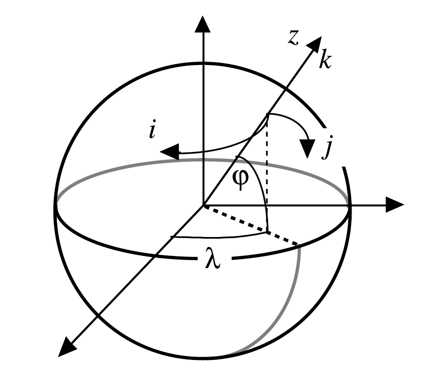
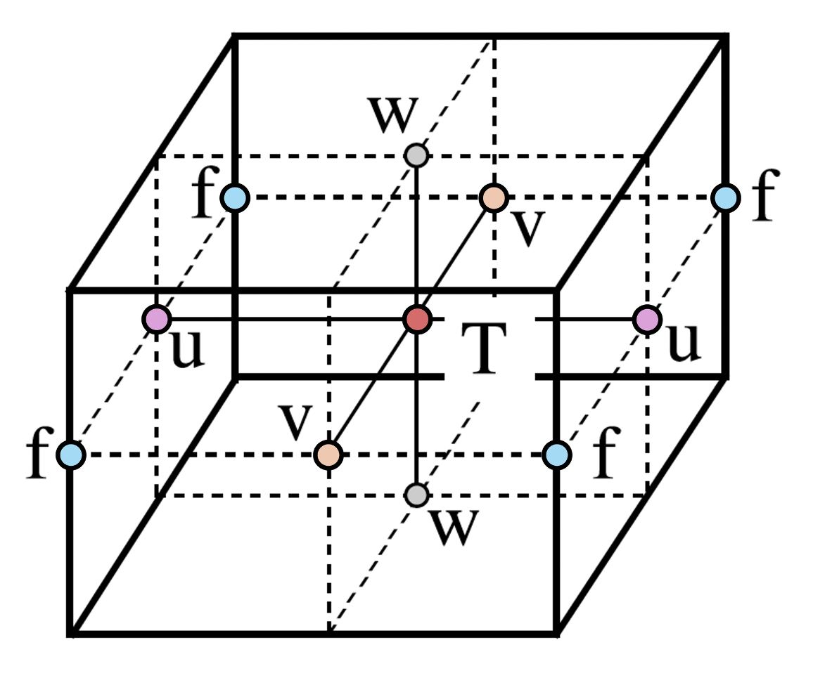

# NEMO Fundamentals

Here, we provide an introduction to the Nucleus for European Modelling of the Ocean (NEMO) framework, including its curvilinear coordinate system, model discretisation and discrete operators.

---

## NEMO Ocean Engine

The **Nucleus for European Modelling of the Ocean (NEMO)** is a state of the art modelling framework of ocean-related engines for research activities and forecasting services in ocean and climate science ([**Madec et al., 2024**](https://doi.org/10.5281/zenodo.14515373)).

The *NEMO Ocean Engine* solves the Primitive Equations using the traditional, centred second-order finite difference approximation. Prognostic variables are the three-dimensional velocity field, $(u, v, w)$, a non-linear sea surface height, $\eta$, the *Conservative Temperature*, $T$, and the *Absolute Salinity*, $S$.

In the horizontal direction, the model uses a curvilinear orthogonal grid and in the vertical direction, a full or partial step $z$-coordinate, or $s$-coordinate, or a
mixture of the two. The distribution of variables is a 3-dimensional Arakawa C-type grid.

→ For a comprehensive guide to the *NEMO Ocean Engine*, see the [**NEMO Reference Manual**](https://doi.org/10.5281/zenodo.14515373).

→ For a guide to configuring **NEMO** ocean model simulations, see the [**NEMO User Guide**](https://sites.nemo-ocean.io/user-guide/).

---

## Curvilinear Coordinate Systems

### Tensorial Formalism

Geographical coordinate systems defined on regular rectilinear grids with a singularity at the North Pole cannot be easily treated in ocean general circulation models. As a consequence, ocean modellers choose to solve the Primitive Equations using a curvilinear coordinate system, typically a 3-dimensional orthogonal grid defined on a sphere with preservation of the local vertical axis.

In NEMO, the ocean mesh (*i.e. location of all the scalar and vector points*) is defined in terms of a set of orthogonal curvilinear coordinates on a sphere ($i, j, k$) with orthogonal unit vectors ($I, J, K$), where $K$ represents the local upward vector and ($I, J$) are orthogonal to $K$.

The geographical coordinate system ($\lambda, \phi, z$) can be expressed in terms of these curvilinear coordinates, such that longitude is $\lambda(i, j)$, latitude is $\phi(i, j)$, and the distance from the centre of the earth is $a + z(k)$, where $a$ is the radius of the earth and $z$ is the height above a reference sea level.

<figure markdown="span">
  { width="300" }
</figure>

To write the scalar and vector operators in the Primitive Equations in tensorial form, three scale factors are introduced describing the local deformation of the curvilinear coordinate system. Horizontal scale factors ($e_{1}$, $e_{2}$) are independent of $k$, while the vertical scale factor $e_{3}$ is a single function of $k$:

$$e_{1} = (a + z)\left[ \left(\frac{\partial \lambda}{\partial i} cos \phi \right)^2 + \left( \frac{\partial \phi}{\partial i} \right)^2 \right]^{1/2} \quad e_{2} = (a + z)\left[ \left(\frac{\partial \lambda}{\partial j} cos \phi \right)^2 + \left( \frac{\partial \phi}{\partial j} \right)^2 \right]^{1/2} \quad e_{3} = \left( \frac{\partial z}{\partial k} \right)$$

The thin-shell approximation allows us to replace the expression $a + z$ by $a$ in the above equations. The resulting horizontal scale factors $e_{1}$, $e_{2}$ are independent of $k$ while the vertical scale factor is a single function of $k$ as $k$ is parallel to $z$.

We can now write the gradient, divergence and curl operators in the Primitive Equations in tensorial form in the ($i, j, k$) coordinate system for a given scalar quantity $q$ and vector $A = (a_{1}, a_{2}, a_{3})$ as follows:

$$\nabla q = \frac{1}{e_{1}} \frac{\partial q}{\partial i} i + \frac{1}{e_{2}} \frac{\partial q}{\partial j} j + \frac{1}{e_{3}} \frac{\partial q}{\partial k} k$$

$$\nabla . A = \frac{1}{e_{1} e_{2} e_{3}} \left[ \frac{\partial (e_{2} a_{1})}{\partial i} + \frac{\partial (e_{1} a_{2})}{\partial j} \right] + \frac{1}{e_{3}} \frac{\partial a_{3}}{\partial k} k$$

$$\nabla \times A = \left[\frac{1}{e_{2}} \frac{\partial a_{3}}{\partial j} - \frac{1}{e_{3}} \frac{\partial a_{2}}{\partial k} \right] i + \left[\frac{1}{e_{3}} \frac{\partial a_{1}}{\partial k} - \frac{1}{e_{1}} \frac{\partial a_{3}}{\partial i} \right] j  + \frac{1}{e_{1} e_{2}} \left[\frac{\partial (e_{2} a_{2})}{\partial i} - \frac{\partial (e_{1} a_{1})}{\partial j} \right] k$$

It is also useful to define the relative vorticity $\zeta$ and the divergence $\chi$ of the horizontal velocity field as follows:

$$\zeta= \frac{1}{e_{1} e_{2}} \left[\frac{\partial (e_{2} v)}{\partial i} - \frac{\partial (e_{1} u)}{\partial j} \right]$$

$$\chi = \frac{1}{e_{1} e_{2}} \left[ \frac{\partial (e_{2} u)}{\partial i} + \frac{\partial (e_{1} v)}{\partial j} \right]$$

### Generalised Vertical Coordinate Systems

There are three primary challenges when defining a vertical coordinate system in an ocean general circulation model:

1. Ocean surface is a time-dependent surface.

2. Ocean floor depends on geographical location, varying from 0 - 6000+ m.

3. Ocean stratification acts as a strong barrier to vertical motion and mixing between water masses.

To address challenge **#1**, NEMO users typically use a space and time-dependent vertical coordinate that accounts for variations in sea surface height (e.g., $z^{*}-$coordinate). Challenge **#2** can be adressed by allowing the vertical coordinate system to vary in space to accomodate changes in bottom topography (e.g., a terrain-following or $\sigma-$coordinate). Finally, challenge **#3** requires use of space and time-dependent vertical coordinate that follows isopycnal surfaces (e.g., a isopycnic coordinate).

For more information on use of generalised vertical coordinates in NEMO, see [**Section 1.4 of the NEMO Reference Manual**](https://doi.org/10.5281/zenodo.14515373).

Below we summarise the most commonly used vertical coordinate systems in NEMO:

**Curvilinear $z^{*}$-coordinate**

* The $z^{*}$ coordinate approach is an unapproximated, non-linear free surface implementation which accounts for large amplitude free-surface variations relative to the vertical resolution ([Adcroft and Campin, 2004](https://doi.org/10.1016/j.ocemod.2003.09.003)).

* Variation of the column thickness due to sea-surface undulations is not concentrated in the surface level, as in the $z$-coordinate formulation, but is equally distributed over the full water column such that vertical levels naturally follow sea-surface variations, with a linear attenuation with depth.

* Surfaces of constant $z^{*}$ are quasi-horizontal, meaning the $z^{*}$ coordinate reduces to $z$ when $\eta$ is zero.

**Curvilinear terrain-following $s$–coordinate**

* Terrain-following ($s$) coordinates conform to the seabed, allowing model layers to follow smooth bottom topography instead of the staircase representation used by traditional $z-$coordinates. This improves the representation of continental slopes, sills, channels, and bottom boundary layer flows.

* $s-$coordinates introduce numerical errors in stratified oceans. The horizontal pressure-gradient force includes an additional term due to the slope of the coordinate surfaces Diffusion along sloping $s$ surfaces can also increase spurious diapycnal mixing over steep topography.

* In NEMO, a hybrid `s`-coordinate formulation is used that combines terrain-following coordinates with full or partial-step bathymetry ("envelope topography"). This reduces pressure-gradient errors while retaining an accurate representation of realistic ocean bathymetry.

---

## Model Discretisation

In NEMO, the numerical techniques used to solve the Primitive Equations are based on the traditional, centred second-order finite difference approximation.

Variables are spatially discretised using a 3-dimensional Arakawa “C” grid ([**Mesinger and Arakawa, 1976**](https://core.ac.uk/download/pdf/141499575.pdf)), comprised of cells centered on scalar points **T** (e.g. conservative temperature, absolute salinity, and horizontal divergence).

<figure markdown="span">
  { width="300" }
</figure>

Vector points (**U**, **V**, **W**) are defined at the center of each cell face. The relative and planetary vorticity, $\zeta$ and $f$, are defined at **F** points, which are located at the centre of each vertical edge.

All grid-points on the ocean mesh are located at integer or integer and a half values of ($i, j, k$) as shown below:

| Grid Type    | Grid Indices                 |
| -----------  | --------------------------   |
| `T`          | $(i, j, k)$                    |
| `U`          | $(i + \frac{1}{2}, j, k)$              |
| `V`          | $(i, j + \frac{1}{2}, k)$              |
| `W`          | $(i, j, k + \frac{1}{2})$              |
| `F`          | $(i + \frac{1}{2}, j + \frac{1}{2}, k)$        |
| `UW`         | $(i + \frac{1}{2}, j, k + \frac{1}{2})$        |
| `VW`         | $(i, j + \frac{1}{2}, k + \frac{1}{2})$        |
| `FW`         | $(i + \frac{1}{2}, j + \frac{1}{2}, k + \frac{1}{2})$  |

For each type of grid, we can define the following properties:

1. **Grid Scale Factors...**

    - Horizontal scale factors (`e1{p}`, `e2{p}`)
    - Vertical scale factor (`e3{p}`)

    ..the volume of a cell is hence given by `(e1{p}.e2{p}.e3{p})`, where `p` is the type of grid point. Similarly, the horizontal area of the cell is given by `(e1{p}.e2{p})`.

2. **Geographical Coordinates...**

    - Longitude $\lambda(i,j)$ and Latitude $\phi(i,j)$ coordinates (`glam{hp}`, `gphi{hp}`)
    - Depth $z(k)$ coordinate (`depth{p}`)

    ...where `p` (`hp`) is the type of (horizontal) grid point. For example, the geographical coordinates corresponding to a **T**-point are (`glamt`, `gphit`, `deptht`).

3. **Land-Sea Masks...**

    - 2-dimensional horizontal (unique point) mask $pmaskutil(i, j)$ given by `{p}maskutil`
    - 3-dimensional land-sea mask $pmask(i, j, k)$ given by `{p}mask`

    ...where $p$ | `p` is the type of grid point. Here, sea points are identified as `True` and land points as `False`.

For more information on the spatial discretisation of variables in NEMO, see [**Section 3.1 of the NEMO Reference Manual**](https://doi.org/10.5281/zenodo.14515373).

### Horizontal Grid Mesh

The values of the geographic longitude (`glam{p}`) and latitude (`gphi{p}`) arrays at indices $i, j$ correspond to the analytical expressions of the longitude $\lambda$ and latitude $\phi$ as a function of ($i, j$), evaluated at the indices listed in the table above for the respective grid-point position.

Notably, the longitudes (`glam`), latitudes (`gphi`) and horizontal scale factors (i.e., `e1`, `e2`) at **W**-points are exactly equal to those defined at **T**-points, hence NEMO does not define `glamw`, `gphiw` and (`e1w`, `e2w`) arrays.

The Coriolis parameter can be derived directly from the horizontal grid mesh as $2 \Omega sin(\phi)$ provided the mesh is defined on a sphere.

### Vertical Grid Mesh

The vertical mesh is comprised of vertical scale factors, depths and water column heights, each of which are dependent upon the chosen vertical coordinate system.

Typically, NEMO model simulations use a quasi-eulerian vertical coordinate which absorbs the divergence of horizontal barotropic velocities (e.g., $z^{*}$ or $s^{*}$), meaning that vertical grid scale factors evolve through time (i.e., a time-varying free surface translates into variations in grid cell thickness).

Hence, NEMO defines proxy arrays describing grid point depths (`gdept`, `gdepw`), water column heights (`ht`, `hu`, `hv`, `hf`) and vertical scale factors (`e3t`, `e3u`, `e3f`, `e3w`, `e3uw`, `e3vw`) which are replaced with appropriate expressions during runtime.

When using a quasi-eulerian vertical coordinate (`key_qco`), such as $z^{*}$, the vertical mesh variables above are substituted by the following expression:

$$H(i, j, k, t) \leftarrow H_0(i, j, k) (1 + r3t(i, j, k)tmask(i, j, k))$$

where $r3t(i, j, k) = \frac{\eta(i, j, t)}{ht_0(i, j)}$ is the ratio of sea surface height to reference water column height and $H$ represents any vertical mesh variable defined on a given NEMO model grid.

In the case of the linear free-surface approximation (`key_linssh`), the free-surface variation is neglected compare to the water column depth, meaning vertical mesh variables are simply substituted for their time-invariant references:

$$H(i, j, k, t) \leftarrow H_0(i, j, k)$$

---

## Discrete Operators

### Differencing & Averaging

Given the values of a variable $q$ defined on the appropriate NEMO model grid (e.g., conservative temperature defined of **T**-points), we can define discrete differencing $\delta[q]$ and averaging $\bar{q}$ operators as follows:

$$\delta_{i + 1/2}[q] = q(i + 1) - q(i)$$

$$\bar{q}^{i + 1/2} = \left[ q(i + 1) + q(i) \right] / 2$$

where $q$ is defined on **T**-points (i.e., $i, i + 1, ...$) and the corresponding difference / average between adjacent **T**-points along the $i$-dimension are located at **U**-points (i.e., $i - 1/2, i + 1/2, ...$).

Similarly, we can define the difference and average of a variable $u$ defined on neighbouring **U**-points along the $i$-dimension:

$$\delta_{i}[q] = q(i + 1/2) - q(i - 1/2)$$

$$\bar{q}^{i} = \left[ q(i + 1/2) + q(i - 1/2) \right] / 2$$

where the difference / average are now defined on neighbouring **T**-points (i.e., $i, i +1, ...$).

### Gradient

The gradient of a scalar variable $q$ defined at **T**-points has three components defined at **U**, **V** and **W**-points which can be defined in discrete form as follows:

$$\nabla q = \frac{1}{e_{1}} \delta_{i + 1/2}[q]\ i + \frac{1}{e_{2}} \delta_{j + 1/2}[q]\ j + \frac{1}{e_{3}} \delta_{k + 1/2}[q]\ k$$

### Divergence

The divergence of a vector $A = (a_{1}, a_{2}, a_{3}) = a_{1}\ i + a_{2}\ j + a_{3}\ k$ whose components are defined on **U**, **V** and **W** vector points is defined at **T**-points in discrete form as follows:

$$\nabla . A = \frac{1}{e_{1t}\ e_{2t}\ e_{3t}} \left[ \delta_{i}(e_{2u}\ e_{3u}\ a_{1}) + \delta_{j}(e_{1v}\ e_{3v}\ a_{2}) \right] + \frac{1}{e_{3}} \delta_{k}(a_{3}) k$$

### Curl

The three components of the curl of a vector $A = (a_{1}, a_{2}, a_{3}) = a_{1}\ i + a_{2}\ j + a_{3}\ k$ whose components are defined on **U**, **V** and **W** vector points are defined at **VW**, **UW** and **F**-points in discrete form as follows:

$$\nabla \times A =  \frac{1}{e_{2v}\ e_{3vw}} \left[ \partial_{j + 1/2}(e_{3w}\ a_{3}) - \delta_{k + 1/2}(e_{2v}\ a_{2}) \right]\ i + \frac{1}{e_{2u}\ e_{3uw}} \left[ \delta_{k + 1/2}(e_{1u}\ a_{1}) - \delta_{i + 1/2}(e_{3w}\ a_{3}) \right]\ j + \frac{1}{e_{1t}\ e_{1f}\ e_{2f}} \left[ \delta_{i + 1/2}(e_{2v}\ a_{2}) - \delta_{j+ 1/2}(e_{1u}\ a_{1}) \right]\ k$$

### Vertical Average

The vertical average of a variable $q$ over the entire water column is given by $\bar{q}$ and defined in discrete form as follows:

$$\bar{q} = \frac{1}{H} \int_{k_{b}}^{k_{s}} q\ e_{3p}\ dk \equiv \frac{1}{H_{p}} \sum_{k} q\ e_{3p}$$

where $H_{p}$ is the ocean depth (i.e., masked sum of vertical scale factors at $p$-points, $k_{b}$ and $k_{s}$ are the bottom and surface k-indices and $\sum_{k}$ refers to a summation over all $p$-grid points along the $k$-dimension.